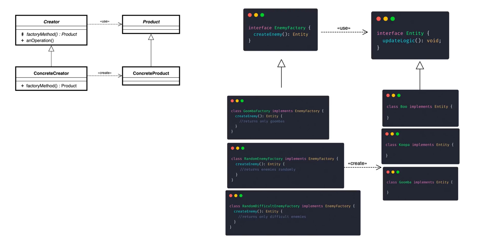

# Design patterns | Factory

Factory consists in a abstraction to manage the creation of classes until certain circunstances

Example: Developing a game, the enemy system

When programming a game, enemies are really important. Each type of enemy could be a different class:

```ts
class Entity {
	updateLogic(): void
}
class Minion implements Entity {
	// Enemy 1
}
class Ghost implements Entity {
	// Enemy 2
}
class Zombie implements Entity {
	// Enemy 2
}
```

This allows us to apply polymorphism, so every time we wanna update something in the game

```ts
function processGameLogic(entities: Entity[]) {
	for (let entity of entities) {
		entity.updateLogic() // Polymorphism! 🔥
	}
}
```

Now imagine we wanna implement random enemies appearing in random places. We would need to create the logic to spawn (instance) new random enemies

```ts
function gameLogic() {
	// More code above
	if (shouldSpawnEnemy()) {
		let randomNum = Math.random()
		let enemy
		if (randomNum > 0.66) {
			enemy = new Minion()
		} else if (randomNum > 0.33) {
			enemy = new Ghost()
		} else {
			enemy = new Zombie()
		}
	}
	// More code below, using the enemy
}
```


Here we would be creating the logic to allow random spawns, and this works perfect (for now)

Now here comes the problem: Some players would like to increase the number of a enemy time, because it makes the game harder and funnier. OK, but... how we modify the logic, increasing the probability of an enemy, without making it for all players at a time? We need to modularize our create enemy system, implementing factory!

```ts
interface EnemyFactory {
	createEnemy(): Entity
}

class RandomEnemyFactory implements EnemyFactory {
	createEnemy(): Entity {
		// returns enemies randomly
	}
}

class RandomDifficultEnemyFactory implements EnemyFactory {
	createEnemy(): Entity {
		// returns only difficult enemies (for example: ghosts and zombies)
	}
}
```

By this, now we can add new creating systems (for example, one that only returns minions) just adding a new class which implements our `EnemyFactory` interface

```ts
class Game {
	private enemyFactory: EnemyFactory

	constructor(enemyFactory: EnemyFactory) {
		this.enemyFactory = enemyFactory
	}

	function gameLogic() {
		// More code above
		if (shouldSpawnEnemy()) {
			let enemy = this.enemyFactory.createEnemy()
		}
		// More code below
	}
}
```

Now we have a general interface to create enemies. We can pass params to each factory to provide rates of spawn or whatever we want.

We have created a very powerful tool, that doesn't affect to any other part of the game, as it is just our general base to create the enemies.

